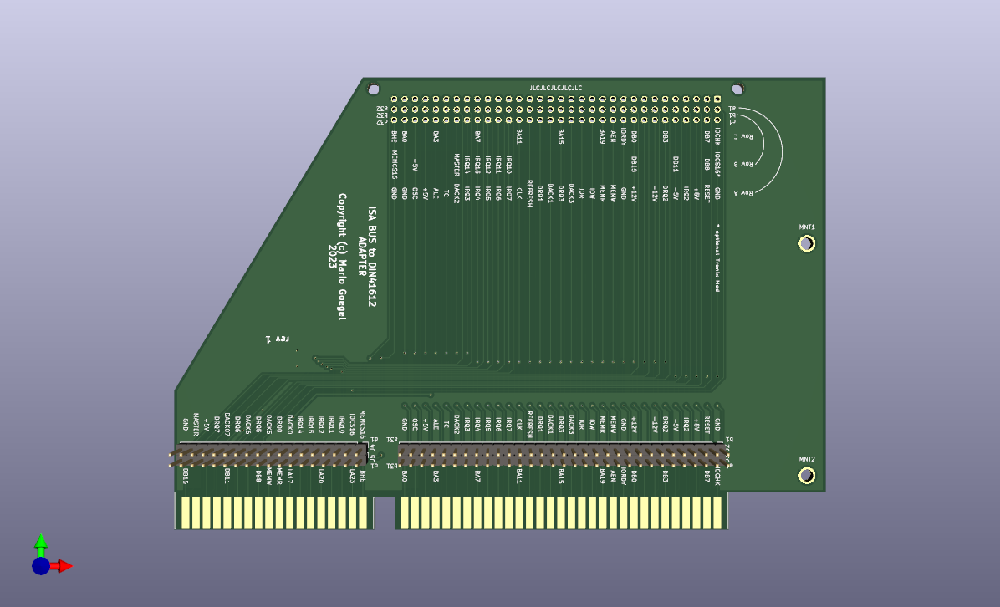

# DIN41612 to ISA Adapter

Here, I created a KiCad 6 Project.

The goal was, to create a PCB for debugging/testing of robotron EC1834 addon Boards on Standard XT PCs.



[Schematics](DIN41612-ISA/DIN41612-ISA.pdf)

Below is the Bill of Materials for the board:

```
Ref(s)      Value                               Mouser P/N
-------------------------------------------------------------------------------
J1          DIN 41612 Type R a+b+c 3x32 PINs    649-8693968837V1LF  
            (96 PINs) Receptacles
J2, J3      13x1 header                         538-22-28-4200 (See Note 1)
J4, J5      31x1 header                         538-22-28-4200 (See Note 1)
BRACKET     Keystone 9202 ISA bracket           534-9202
SCREWS      4-40 x 1/4" machine screw           534-9301
```

But the 
Note 1: Order a 20 (or greater) breakaway header, break into the required lengths.
